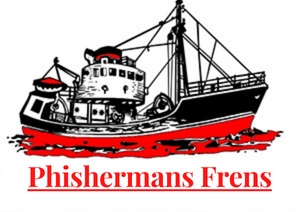

# Phishermans Frens

A simple rust CLI to search if a URL is blacklisted as a phishing link.

### Install from source

```
git clone https://github.com/0xKoda/bl &&
cd bl 
```

### Usage

Input a URL, will return GREEN if not on the list, and RED if it appears on the blacklist. 

Works Like a CLI, without installing to path, run:

Example:  `cargo run MetaMask.com`


### TODO

- Initial URL search [X]
- Refactor list to new path []
- Add TLD IP search []

### Credits

Blacklist derived from MM [Eth Phishing Detect](https://github.com/MetaMask/eth-phishing-detect/tree/main/src)